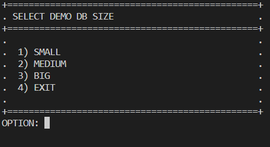

# Airport Flights API 


This project use this database template [airline flights](https://postgrespro.com/community/demodb)

Using Entity Framework and Using Scaffold (reverse engineering) the database model is created.


### Database Schema Diagram


### Summary 
In this repository, an application is deployed through docker compose which downloads the test database and restores it to a postgres 14 service, which is used by the Airport Flights API developed in .Net.


### Tools and Framework used

- .Net 6.0
- Docker and Docker Compose
- Entity FrameWork
- PostgreSQL
- LinkQ
- Bash Scripting
- Batch Scripting

### Requirements:
- Docker and Docker Compose
- Curl
- .Net 6.0 or higher

### How to start the application

Find the init.bat file and run it as follows in the Visual Studio Code terminal, then select and type the option.

```
.\init.bat
```


Once selected the option will download and restore the database backup with the selected size, then start the ASP .Net application with swagger enabled to easily test the endpoints, started at the following url:

```
http://localhost:3000/swagger/index.html
```

> This has only been tested on windows, if you need to deploy it on linux, it is necessary to make a bash startup script using the steps in the init.bat as a template.
